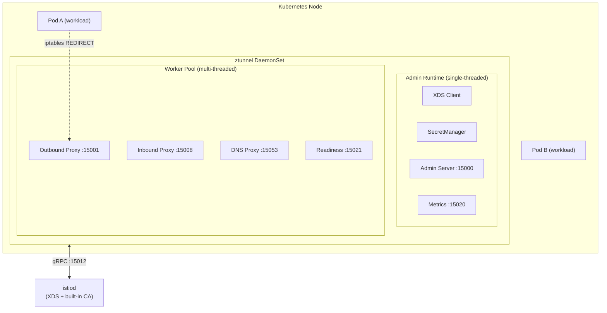
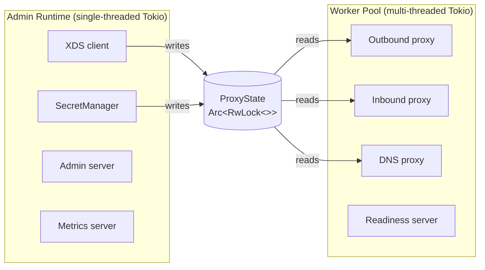
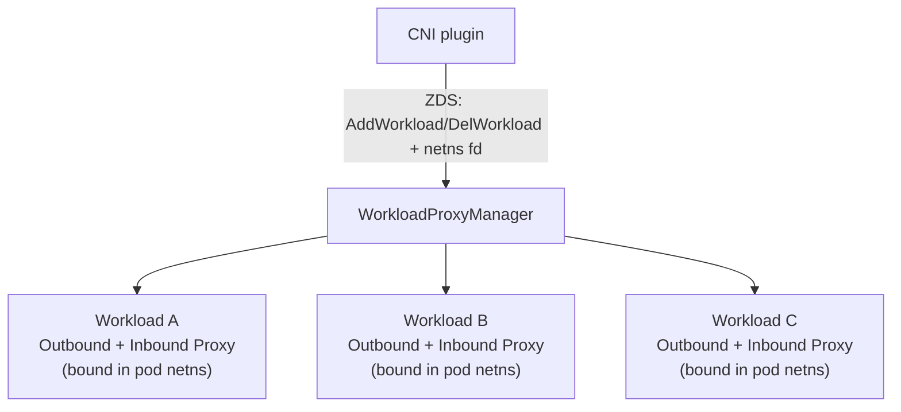
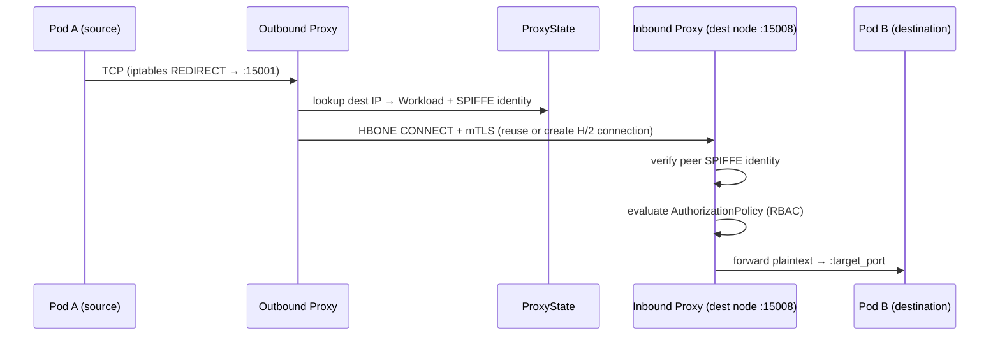
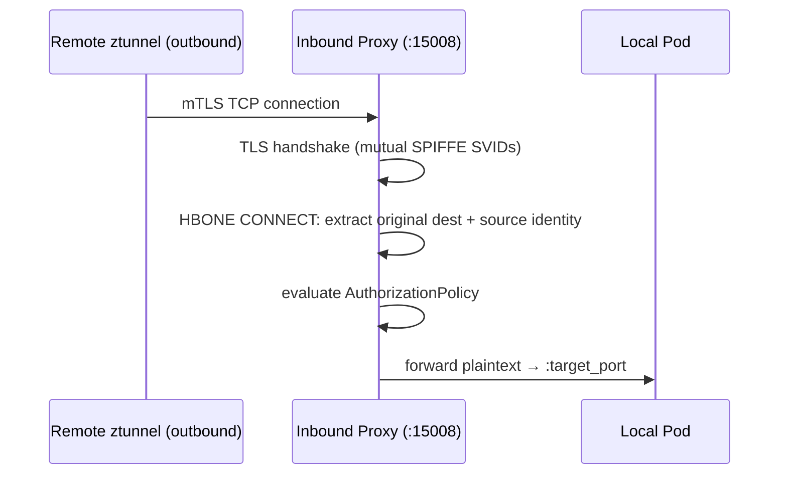

# Architecture

This document describes the high-level architecture of ztunnel.

See also [Development.md](Development.md) for build setup, test commands, and contribution guidelines.

## Project Structure

```
ztunnel/
├── src/
│   ├── proxy/                      # HBONE proxy: inbound, outbound, passthrough, SOCKS5
│   │   ├── inbound.rs              # HBONE inbound: TLS termination, RBAC enforcement
│   │   ├── outbound.rs             # Outbound: traffic capture, HBONE upgrade, routing
│   │   ├── inbound_passthrough.rs  # Passthrough for unencrypted inbound traffic
│   │   ├── socks5.rs               # SOCKS5 proxy for outbound in-pod mode
│   │   ├── h2.rs                   # HTTP/2 framing for HBONE tunnels
│   │   ├── h2/                     # H/2 submodules (flow control, stream handling)
│   │   ├── pool.rs                 # H/2 connection pooling to remote ztunnels
│   │   ├── connection_manager.rs   # Connection lifecycle and graceful drain
│   │   └── metrics.rs              # Per-connection Prometheus metrics
│   ├── tls/                        # TLS stack (rustls + pluggable crypto backends)
│   │   ├── lib.rs                  # TLS abstractions and cert verification
│   │   ├── certificate.rs          # Certificate parsing and validation
│   │   ├── workload.rs             # Per-workload TLS configuration
│   │   ├── crl.rs                  # CRL manager for certificate revocation
│   │   └── revocation.rs           # OCSP/CRL revocation checking
│   ├── identity/                   # SPIFFE identity and certificate lifecycle
│   │   ├── manager.rs              # SecretManager: cert fetching, caching, rotation
│   │   ├── auth.rs                 # SPIFFE ID parsing and validation
│   │   └── caclient.rs             # CA gRPC client (Citadel / istiod)
│   ├── xds/                        # XDS client (workload and policy discovery)
│   │   ├── client.rs               # Delta XDS gRPC stream against istiod
│   │   └── types.rs                # XDS resource type conversions
│   ├── inpod/                      # Shared (in-pod) proxy mode
│   │   ├── workloadmanager.rs      # Per-workload proxy lifecycle
│   │   ├── statemanager.rs         # Workload state tracking
│   │   ├── netns.rs                # Network namespace operations
│   │   └── protocol.rs             # ZDS wire protocol (ztunnel daemon socket)
│   ├── dns/                        # DNS proxy and resolver
│   ├── state/                      # Shared proxy state (workloads, services, policies)
│   │   ├── workload.rs             # WorkloadStore: IP → Workload mapping
│   │   ├── service.rs              # ServiceStore: VIP → Service + Endpoint
│   │   └── policy.rs               # PolicyStore: authorization policies
│   ├── metrics/                    # Prometheus metrics infrastructure
│   ├── admin.rs                    # Admin HTTP server (debug endpoints)
│   ├── app.rs                      # Runtime initialization and startup
│   ├── config.rs                   # Configuration (env vars, feature flags)
│   ├── proxyfactory.rs             # Creates proxies per workload (dedicated and in-pod)
│   ├── rbac.rs                     # RBAC authorization evaluation
│   └── state.rs                    # ProxyState and ProxyStateManager
├── proto/                          # Protobuf definitions (XDS and ZDS wire format)
├── tests/                          # Integration tests
└── benches/                        # Criterion benchmarks
```

## High-Level System Diagram

Ztunnel runs as a DaemonSet — one instance per Kubernetes node — and handles ambient mesh traffic for all pods on that node without sidecars.



## Runtime Architecture

Ztunnel deliberately isolates control-plane and data-plane work into two separate Tokio async runtimes. This prevents slow or expensive control-plane operations (XDS updates, metrics scraping) from affecting data-plane latency, and vice versa.

### Admin Runtime (single-threaded)

A **single-threaded** Tokio runtime (one Tokio executor thread) responsible for all control-plane operations:

- **XDS client** — Delta XDS gRPC stream to istiod; receives `Workload`, `Service`, and `Authorization` updates and writes them to the shared `ProxyState`.
- **SecretManager** — Fetches and rotates SPIFFE X.509 SVIDs from the CA. Rotation is transparent to the data plane via shared certificate state.
- **Admin server** (port 15000, localhost only) — HTTP debug endpoints: config dump, connection list, log-level changes, graceful shutdown.
- **Metrics server** (port 15020) — Prometheus scrape endpoint. Isolated here because metrics collection can be expensive; keeping it off the worker runtime avoids tail-latency spikes.

### Worker Runtime (multi-threaded)

A **multi-threaded** Tokio runtime (at least 2 threads; scales with CPU resource limits, configurable via `ZTUNNEL_WORKER_THREADS`) responsible for all data-plane I/O:

- **Outbound proxy** — Captures redirected pod outbound traffic and upgrades it to HBONE over mTLS.
- **Inbound proxy** — Accepts HBONE connections, terminates mTLS, enforces RBAC, forwards plaintext to the local pod.
- **Inbound passthrough** — Handles plaintext inbound traffic from non-mesh sources.
- **DNS proxy** — Intercepts pod DNS queries and resolves them, with headless service support.
- **Readiness server** (port 15021) — Liveness/readiness probe. Intentionally on the worker runtime to exercise the actual data-plane path.

### Runtime Isolation

State flows in one direction: the admin runtime writes; the worker runtime reads.



The two runtimes communicate through an `Arc<RwLock<ProxyState>>` for state reads and a Tokio `watch` channel that signals when XDS updates have been applied.

## Core Components

### Proxy Subsystem (`src/proxy/`)

| Component | Port(s) | Description |
|---|---|---|
| `Outbound` | 15001 | Captures pod outbound traffic via iptables REDIRECT. Looks up the destination in `ProxyState`, upgrades to HBONE, and opens (or reuses) an mTLS H/2 connection to the remote ztunnel. |
| `Inbound` | 15008 | Receives HBONE connections from remote ztunnels. Terminates mTLS, validates peer SPIFFE identity, enforces `AuthorizationPolicy`, then forwards plaintext to the local pod. |
| `InboundPassthrough` | 15006 | Receives plaintext inbound traffic for workloads not yet enrolled in ambient, or from non-mesh sources. Forwards without TLS. |
| `Socks5` | 15080 | SOCKS5 proxy for pod outbound traffic in shared mode (inside the pod network namespace). |
| `ConnectionManager` | — | Tracks live connections and drains them on shutdown. Watches `PolicyStore` and closes connections that become unauthorized after a policy update. |
| H/2 Connection Pool (`pool.rs`) | — | H/2 connection pool for outbound HBONE. Reuses connections to the same destination ztunnel across multiple pod-to-pod streams, controlled by `POOL_MAX_STREAMS_PER_CONNECTION`. |

### XDS Client (`src/xds/`)

Connects to istiod via a Delta XDS gRPC stream (the Ambient Workload Discovery Service, port 15012). Receives and processes three resource types:

| XDS Resource | Effect |
|---|---|
| `Address` (Workload) | Populates `WorkloadStore`: network address → `Workload` (identity, protocol, tunnel type). |
| `Address` (Service) | Populates `ServiceStore`: VIP → `Service` + `Endpoint` list with load-balancing configuration. |
| `Authorization` | Populates `PolicyStore`: RBAC rules evaluated on every inbound connection. |

XDS updates are applied atomically; after each apply, a Tokio `watch` channel notifies the worker runtime that new state is available. On-demand XDS (`XDS_ON_DEMAND=true`) defers workload fetches until the first connection to that destination.

### Identity and Certificate Management (`src/identity/`)

- **`SecretManager`** manages the SPIFFE X.509 SVID lifecycle: requesting certificates from the CA, caching them in memory, and rotating them before expiry.
- **`CaClient`** is a gRPC client implementing the Istio certificate signing API (`istio.v1.auth.IstioCertificateService`). It communicates with istiod's built-in Citadel or an external CA.
- Each workload's identity is a SPIFFE URI: `spiffe://<trust-domain>/ns/<namespace>/sa/<service-account>`.
- In shared mode, each workload fetches its own certificate using its pod service account token, so ztunnel never holds a cross-workload certificate.
- Certificate revocation is enforced at TLS handshake time via CRL files (`CRL_PATH`).

### Shared State (`src/state.rs`, `src/state/`)

`ProxyState` is the central read-only view of the mesh, shared between the admin and worker runtimes via `Arc<RwLock<>>`.

| Sub-store | Key | Value |
|---|---|---|
| `WorkloadStore` | Network address (IP + network) | `Workload` (UID, name, namespace, identity, protocol, waypoint) |
| `ServiceStore` | VIP or hostname | `Service` with endpoint list and load-balancing mode |
| `PolicyStore` | Policy name | `Authorization` (RBAC rules: source identity, destination port, namespace) |

`ProxyStateManager` owns the writable side. It applies XDS deltas to `ProxyState` and signals the worker runtime when updates are complete.

`DemandProxyState` is a wrapper used by data-plane components that supports on-demand XDS: if a workload is not in the local store, it sends a targeted XDS request to istiod and waits for the response.

### Shared Mode (`src/inpod/`)

Shared mode (`PROXY_MODE=shared`, also called in-pod mode) is the default Kubernetes deployment mode. A single ztunnel DaemonSet manages traffic for all workloads on the node by operating inside each pod's network namespace:

1. **ZDS protocol** — ztunnel opens a Unix domain socket (`INPOD_UDS`, default `/var/run/ztunnel/ztunnel.sock`). The CNI plugin sends `AddWorkload` / `DelWorkload` messages over this socket as pods join or leave the ambient mesh. Each message carries a file descriptor for the pod's network namespace.
2. **Network namespace binding** — on receiving `AddWorkload`, ztunnel enters the pod's network namespace via the received fd and binds the proxy ports (outbound 15001, inbound 15008, SOCKS5 15080, DNS 15053) inside it. Traffic redirection happens entirely within the pod's own network namespace.
3. **`WorkloadProxyManager`** — owns per-workload proxy instances. Creates a fresh `Proxy` (outbound + inbound) for each workload and destroys it when the workload is removed.



**Dedicated mode** (`PROXY_MODE=dedicated`) is an alternative deployment model where ztunnel manages a single workload's traffic using `PROXY_WORKLOAD_INFO`. It is used for the ztunnel pod's own traffic in shared mode.

### Admin Server (`src/admin.rs`)

HTTP server bound to `127.0.0.1:15000`. Key endpoints:

| Endpoint | Description |
|---|---|
| `GET /config_dump` | Full state dump (workloads, services, policies, active connections) |
| `GET /connections` | Active connection list with source/destination and identity |
| `POST /logging` | Adjust tracing log level at runtime |
| `POST /quitquitquit` | Trigger graceful shutdown |
| `GET /certs` | Current certificate status and expiry |

## Traffic Flow

### Outbound (Pod → Mesh)



If the destination is not enrolled in the ambient mesh, the outbound proxy falls back to direct TCP pass-through.

### Inbound (Mesh → Pod)



## Ports Reference

| Port  | Runtime | Purpose                               | Pod Netns? |
|-------|---------|---------------------------------------|:----------:|
| 15001 | Worker  | Outbound traffic capture (REDIRECT)   | Y          |
| 15006 | Worker  | Inbound plaintext passthrough         | Y          |
| 15008 | Worker  | HBONE inbound (mTLS H/2 CONNECT)      | Y          |
| 15053 | Worker  | DNS traffic capture                   | Y          |
| 15080 | Worker  | Outbound SOCKS5 (shared mode)         | Y          |
| 15021 | Worker  | Readiness probe                       | N          |
| 15000 | Admin   | Admin (localhost only)                | N          |
| 15020 | Admin   | Metrics (Prometheus scrape)           | N          |

> **NetworkPolicy**: Port 15008 must be open on ztunnel DaemonSet pods for ambient mesh traffic
> to flow. The ports that ztunnel binds inside each pod's network namespace (15001, 15006, 15008,
> 15053, 15080) do not need to be permitted by the user workload's own NetworkPolicy — ztunnel's
> DaemonSet NetworkPolicy covers them. See [Ambient and Kubernetes NetworkPolicy](https://istio.io/latest/docs/ambient/usage/networkpolicy/).

The three admin-facing ports are intentionally split:

- **Readiness** (15021) runs on the worker runtime to test the real data-plane path.
- **Admin** (15000) is localhost-only and on the admin runtime for isolation.
- **Metrics** (15020) is on the admin runtime; scraping can be expensive and must not affect data-plane tail latency.

## TLS and Cryptography

Ztunnel uses [rustls](https://github.com/rustls/rustls) with a pluggable crypto backend selected at compile time:

| Feature flag | Invocation | Backend | Notes |
|---|---|---|---|
| `tls-aws-lc` *(default)* | `cargo build` | [aws-lc-rs](https://github.com/aws/aws-lc-rs) | Default upstream build |
| `tls-ring` | `--features tls-ring --no-default-features` | [ring](https://github.com/briansmith/ring) | |
| `tls-boring` | `--features tls-boring --no-default-features` | [BoringSSL](https://github.com/cloudflare/boring) | FIPS-validated binary; vendored per arch under `vendor/boringssl-fips/` |
| `tls-openssl` | `--features tls-openssl --no-default-features` | [rustls-openssl](https://github.com/tofay/rustls-openssl) | Routes through system OpenSSL |

All backends use **TLS 1.3 only** with cipher suites `TLS13_AES_256_GCM_SHA384` and `TLS13_AES_128_GCM_SHA256`.

Certificate revocation is enforced at handshake time via CRL files loaded from `CRL_PATH`.

## Configuration

All configuration is driven by environment variables. Key variables:

| Variable | Default | Description |
|---|---|---|
| `PROXY_MODE` | `shared` | `shared` (in-pod DaemonSet) or `dedicated` (per-workload) |
| `ZTUNNEL_WORKER_THREADS` | 2 (floor) | Number of data-plane Tokio worker threads |
| `XDS_ADDRESS` | `istiod.istio-system:15012` | istiod XDS endpoint |
| `CA_ADDRESS` | `istiod.istio-system:15012` | CA endpoint for certificate requests |
| `INPOD_UDS` | `/var/run/ztunnel/ztunnel.sock` | ZDS Unix domain socket path (shared mode) |
| `CLUSTER_ID` | — | Cluster identifier for multi-cluster deployments |
| `CLUSTER_DOMAIN` | `cluster.local` | DNS search domain |
| `XDS_ON_DEMAND` | `false` | Fetch workload XDS lazily on first connection |
| `CRL_PATH` | — | Path to CRL file for certificate revocation |
| `POOL_MAX_STREAMS_PER_CONNECTION` | 100 | Maximum H/2 streams per HBONE connection |
| `FAKE_CA` | `false` | Use a self-signed test CA (requires `--features testing`) |

## Key Technologies

| Technology | Role |
|---|---|
| Rust | Implementation language |
| Tokio | Async runtime (two isolated instances) |
| rustls | TLS with pluggable crypto backend |
| tonic | gRPC (XDS client, CA client) |
| hyper | HTTP/2 (HBONE tunnel transport) |
| hickory-dns | DNS proxy and resolver |
| prometheus-client | Prometheus metrics |
| prost | Protobuf (XDS and ZDS wire format) |

## Development and Testing

### Build Targets

```bash
cargo build                                               # Default (tls-aws-lc backend)
cargo build --features tls-openssl --no-default-features  # OpenSSL backend
cargo build --features tls-boring --no-default-features   # BoringSSL FIPS build
```

### Testing Layers

- **Unit tests** (`#[test]`, `#[tokio::test]` throughout `src/`): Run with `cargo test`.
- **Integration tests** (`tests/`): End-to-end scenarios with real network namespaces. Run with `cargo test --test <suite>`.
- **Feature-flag coverage**: TLS-related changes should be tested against the relevant TLS backend feature flags.
- **Benchmarks** (`benches/`): Criterion benchmarks for data-plane throughput. Run with `cargo bench`.

### Code Quality

```bash
cargo build && cargo test && cargo clippy -- -D warnings
```

All three must pass before submitting a PR.
